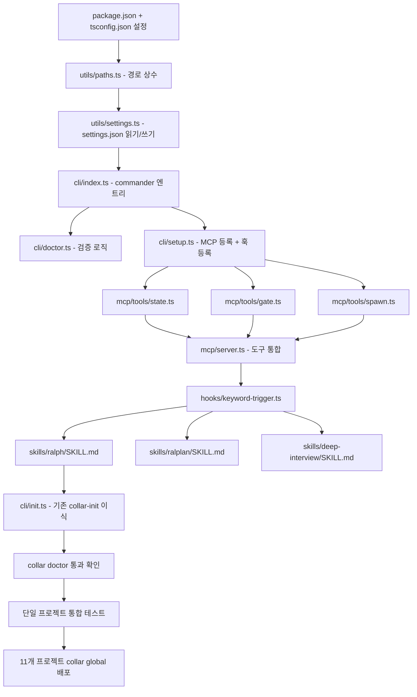

# collar npm 패키지 설계서

**작성일:** 2026-05-17  
**목적:** 다음 세션에서 이 문서 단독으로 구현 가능하도록 완전한 설계 기술  
**구현 범위:** Phase 1 (CLI) → Phase 2 (로컬 stdio MCP) → Phase 3 (스킬 시스템) → 11개 프로젝트 배포

---

## 1. 배경 및 결정 사항

### 왜 npm 패키지로 전환하는가

현재 collar는 쉘 스크립트 + 템플릿 파일 기반이다.  
이 방식의 근본 한계:

- **키워드 트리거**: AI가 "감지해야 한다는 규칙"만 존재 → 메시지 인터셉트는 코드만 가능
- **에이전트 역할 주입**: "Agent() 도구 써라"만 명시 → spawn 전 role 파일 자동 읽기는 코드만 가능
- **강제 검증 게이트**: "완료 전 체크리스트" 규칙만 존재 → 조건 미충족 시 차단은 코드만 가능

규칙 기반은 AI가 작업 압박 시 망각한다 (lottery 사고 2026-05-16 근본 원인).  
코드 기반 훅/MCP만이 신뢰성을 보장한다.

### 아키텍처 결정

| 결정 | 선택 | 이유 |
|------|------|------|
| 패키지 형태 | npm 글로벌 패키지 | OMC/OMX와 동일 생태계, `collar` 단일 명령어 |
| MCP 방식 | 로컬 stdio MCP | 서버 불필요, 로컬 파일 직접 접근, 네트워크 레이턴시 없음 |
| 언어 | TypeScript | 타입 안전성, MCP SDK 공식 지원 |
| 원격 MCP | 불채택 | 개인 사용 목적, 로컬 stdio로 충분 |

### 참고 시스템

- **oh-my-claudecode (OMC)**: Claude Code용 멀티에이전트 오케스트레이션. spawn_agent 프로토콜, 키워드 트리거, team 파이프라인 상태머신
- **oh-my-codex (OMX)**: Codex CLI용. `prompts/` 디렉토리 기반 역할 파일, sisyphus-lite(반복 루프)
- **collar 현재**: `~/.collar/bin/` 쉘 스크립트, `templates/` 파일, `.collar/` 프로젝트 상태

---

## 2. 저장소 구조

### 2-A. npm 패키지 구조 (collar 레포 내 신규 디렉토리)

```
collar/
├── package/                        ← npm 패키지 루트 (신규)
│   ├── package.json
│   ├── tsconfig.json
│   ├── src/
│   │   ├── cli/
│   │   │   ├── index.ts            ← CLI 엔트리 (commander.js)
│   │   │   ├── setup.ts            ← collar setup
│   │   │   ├── init.ts             ← collar init [project-path]
│   │   │   ├── doctor.ts           ← collar doctor
│   │   │   ├── update.ts           ← collar update
│   │   │   └── global.ts           ← collar global [--force]
│   │   ├── mcp/
│   │   │   ├── server.ts           ← stdio MCP 서버 엔트리
│   │   │   └── tools/
│   │   │       ├── state.ts        ← collar_state_read/write/clear/list
│   │   │       ├── gate.ts         ← collar_gate_check
│   │   │       └── spawn.ts        ← collar_spawn_agent
│   │   ├── hooks/
│   │   │   ├── keyword-trigger.ts  ← UserPromptSubmit 키워드 감지
│   │   │   └── commit-guard.ts     ← PostToolUse 커밋/push 감시
│   │   └── utils/
│   │       ├── paths.ts            ← 경로 상수 (COLLAR_HOME 등)
│   │       ├── settings.ts         ← .claude/settings.json 읽기/쓰기
│   │       └── project.ts          ← 프로젝트 타입 감지
│   ├── skills/                     ← 스킬 Markdown 파일
│   │   ├── ralph/SKILL.md
│   │   ├── ralplan/SKILL.md
│   │   └── deep-interview/SKILL.md
│   └── dist/                       ← tsc 빌드 출력 (gitignore)
├── bin/                            ← 기존 쉘 스크립트 (Phase 1 완료 후 deprecated)
├── templates/                      ← 기존 템플릿 (collar init이 계속 사용)
└── doc/
    └── 2026-05-17-npm-package-design.md   ← 이 파일
```

### 2-B. 설치 후 사용자 홈 구조

```
~/.collar/
├── bin/                            ← 기존 설치 경로 (deprecated 후 제거)
├── skills/                         ← 스킬 파일 (collar setup이 복사)
│   ├── ralph/SKILL.md
│   ├── ralplan/SKILL.md
│   └── deep-interview/SKILL.md
├── prompts/                        ← 역할 프롬프트 (collar setup이 복사)
│   ├── executor.md
│   ├── architect.md
│   ├── verifier.md
│   └── ...
└── .global-version                 ← 글로벌 규칙 해시 (기존)
```

### 2-C. 프로젝트별 구조 (.collar/ — collar init 후)

```
.collar/
├── session-compact.md              ← 세션 압축 (기존)
├── memory.md                       ← 프로젝트 메모리 (기존)
├── config.json                     ← 프로젝트 설정 (기존)
├── state/                          ← MCP 상태 파일 (신규)
│   ├── ralph.json                  ← $ralph 실행 상태
│   ├── ralplan.json                ← $ralplan 계획 상태
│   └── team.json                   ← 팀 파이프라인 상태
└── hooks/                          ← 기존 hook 파일들
    ├── collar-dispatcher.sh
    ├── session-monitor.sh
    └── 30-commit-guard.sh
```

---

## 3. package.json

```json
{
  "name": "collar-cli",
  "version": "0.1.0",
  "description": "AI harness standardization layer for Claude Code",
  "type": "module",
  "bin": {
    "collar": "./dist/cli/index.js"
  },
  "scripts": {
    "build": "tsc",
    "dev": "tsc --watch",
    "prepublishOnly": "npm run build"
  },
  "dependencies": {
    "@modelcontextprotocol/sdk": "^1.0.0",
    "commander": "^12.0.0",
    "chalk": "^5.0.0",
    "ora": "^8.0.0",
    "glob": "^11.0.0",
    "zod": "^3.0.0"
  },
  "devDependencies": {
    "typescript": "^5.0.0",
    "@types/node": "^20.0.0"
  },
  "engines": {
    "node": ">=20"
  },
  "files": [
    "dist/",
    "skills/",
    "prompts/"
  ]
}
```

---

## 4. Phase 1: CLI

### 4-A. 엔트리 (src/cli/index.ts)

```typescript
#!/usr/bin/env node
import { program } from 'commander';
import { setup } from './setup.js';
import { init } from './init.js';
import { doctor } from './doctor.js';
import { update } from './update.js';
import { globalCmd } from './global.js';
import { mcpServe } from '../mcp/server.js';

program.name('collar').version('0.1.0');

program.command('setup').description('Install collar globally').action(setup);
program.command('init [path]').description('Initialize collar in a project').action(init);
program.command('doctor').description('Verify collar installation').action(doctor);
program.command('update').description('Update collar and re-run setup').action(update);
program.command('global').option('--force', 'Force re-apply').description('Apply global rules to all projects').action(globalCmd);
program.command('mcp-serve').description('Start MCP server (stdio)').action(mcpServe);

program.parse();
```

### 4-B. collar setup (src/cli/setup.ts)

실행 순서:

1. `~/.collar/skills/` 생성 + 패키지 내 `skills/` 복사
2. `~/.collar/prompts/` 생성 + 패키지 내 `prompts/` 복사
3. `~/.claude/CLAUDE.md`에 글로벌 규칙 병합 (기존 collar-global 로직 이식)
4. `~/.claude/settings.json`에 MCP 서버 등록:
   ```json
   {
     "mcpServers": {
       "collar": {
         "command": "collar",
         "args": ["mcp-serve"],
         "type": "stdio"
       }
     }
   }
   ```
5. `~/.claude/settings.json`에 키워드 훅 등록:
   ```json
   {
     "hooks": {
       "UserPromptSubmit": [
         {
           "matcher": "",
           "hooks": [{"type": "command", "command": "node ~/.collar/hooks/keyword-trigger.mjs"}]
         }
       ]
     }
   }
   ```
6. `~/.collar/` PATH 제거 (npm global bin이 대체)
7. 완료 메시지

**중요**: settings.json 수정 시 기존 항목 보존. 덮어쓰기 금지. 딥 머지.

### 4-C. collar init (src/cli/init.ts)

기존 `bin/collar-init` 쉘 스크립트 로직을 TypeScript로 이식.

실행 순서:
1. 대상 경로 결정 (`./` 기본값)
2. 프로젝트 타입 감지 (`utils/project.ts`)
3. `.collar/` 디렉토리 생성
4. `templates/CLAUDE.md.base` → `CLAUDE.md` 생성 (없으면)
5. `templates/AGENTS.md.base` → `AGENTS.md` 생성 (없으면)
6. `templates/config.json` → `.collar/config.json` 생성 (없으면)
7. `.claude/settings.json` 훅 등록:
   - `collar-dispatcher.sh` (기존 방식 유지)
8. `.collar/state/` 디렉토리 생성 (MCP 상태용)
9. 멱등성 보장: 이미 있는 파일 덮어쓰지 않음

### 4-D. collar doctor (src/cli/doctor.ts)

체크 항목 (모두 통과해야 정상):

| 체크 | 방법 |
|------|------|
| Node.js >= 20 | `process.version` |
| collar npm 설치 | `which collar` |
| `~/.collar/skills/` 존재 | `fs.existsSync` |
| `~/.claude/settings.json` MCP 등록 | JSON 파싱 후 `mcpServers.collar` 확인 |
| `~/.claude/settings.json` 훅 등록 | `hooks.UserPromptSubmit` 확인 |
| MCP 서버 응답 | `collar mcp-serve` 프로세스 1초 테스트 |

### 4-E. collar update (src/cli/update.ts)

```
1. npm install -g collar-cli (최신 버전)
2. collar setup --force 재실행
3. collar doctor 실행
```

### 4-F. collar global (src/cli/global.ts)

기존 `bin/collar-global` 쉘 스크립트 로직을 TypeScript로 이식.

- `templates/global/CLAUDE.md.rules` → `~/.claude/CLAUDE.md` 섹션 병합 (제목 기반 중복 체크)
- `templates/global/memory/*.md` → 프로젝트 메모리 디렉토리 파일 존재 여부 체크 후 복사
- 버전 해시로 변경 없으면 즉시 종료

---

## 5. Phase 2: 로컬 stdio MCP 서버

### 5-A. 서버 엔트리 (src/mcp/server.ts)

```typescript
import { Server } from '@modelcontextprotocol/sdk/server/index.js';
import { StdioServerTransport } from '@modelcontextprotocol/sdk/server/stdio.js';
import { registerStateTools } from './tools/state.js';
import { registerGateTools } from './tools/gate.js';
import { registerSpawnTools } from './tools/spawn.js';

const server = new Server({ name: 'collar', version: '0.1.0' }, {
  capabilities: { tools: {} }
});

registerStateTools(server);
registerGateTools(server);
registerSpawnTools(server);

const transport = new StdioServerTransport();
await server.connect(transport);
```

### 5-B. 상태 도구 (src/mcp/tools/state.ts)

상태 파일 위치: `.collar/state/{mode}.json` (현재 프로젝트) 또는 `~/.collar/state/{mode}.json` (글로벌)

#### `collar_state_write`
```
입력: { mode: string, data: object }
동작: .collar/state/{mode}.json에 data를 JSON으로 저장. 타임스탬프 자동 추가.
반환: { success: true, path: string }
```

#### `collar_state_read`
```
입력: { mode: string }
동작: .collar/state/{mode}.json 읽기
반환: { data: object | null }
```

#### `collar_state_clear`
```
입력: { mode: string }
동작: .collar/state/{mode}.json 삭제
반환: { success: true }
```

#### `collar_state_list`
```
입력: {}
동작: .collar/state/ 내 모든 활성 상태 나열
반환: { modes: Array<{mode, active, started_at, current_phase}> }
```

상태 파일 스키마 예시:
```json
{
  "mode": "ralph",
  "active": true,
  "iteration": 3,
  "max_iterations": 20,
  "current_phase": "execution",
  "started_at": "2026-05-17T10:00:00Z",
  "completed_at": null,
  "task": "Fix all failing tests"
}
```

### 5-C. 게이트 도구 (src/mcp/tools/gate.ts)

#### `collar_gate_check`
```
입력: {
  gates: Array<{
    type: 'file_exists' | 'state_active' | 'git_clean' | 'git_pushed' | 'custom',
    path?: string,      // file_exists용
    mode?: string,      // state_active용
    command?: string,   // custom용 (exit 0이면 통과)
    message: string     // 실패 시 표시할 메시지
  }>
}
동작: 각 게이트 조건 순서대로 검사
반환: {
  passed: boolean,
  results: Array<{gate, passed, message}>
}
```

사용 예시 (AI가 완료 선언 전 호출):
```json
{
  "gates": [
    {"type": "git_clean", "message": "미커밋 변경이 있습니다. git commit 먼저 실행하세요."},
    {"type": "git_pushed", "message": "미push 커밋이 있습니다. git push 먼저 실행하세요."},
    {"type": "file_exists", "path": ".collar/state/tests-passed", "message": "테스트 통과 증거 파일이 없습니다."}
  ]
}
```

### 5-D. 스폰 도구 (src/mcp/tools/spawn.ts)

#### `collar_spawn_agent`
```
입력: { role: string, task: string }
동작:
  1. ~/.collar/prompts/{role}.md 읽기
  2. 역할 프롬프트 + 태스크를 결합한 메시지 반환
반환: {
  role_prompt: string,   // ~/.collar/prompts/{role}.md 내용
  task: string,
  combined_message: string  // "role_prompt\n\nTask: task"
}
```

**중요**: 이 도구는 실제 에이전트를 spawn하지 않는다. Claude Code의 Agent() 호출 시 넣을 메시지를 준비해준다. AI가 이 내용을 받아 Agent() 도구를 호출한다.

---

## 6. Phase 3: 스킬 시스템

### 6-A. 스킬 파일 위치 및 로드 방법

스킬 파일: `~/.collar/skills/{skill-name}/SKILL.md`

AI가 `$ralph` 같은 키워드를 입력하면:
1. **키워드 훅** (UserPromptSubmit)이 키워드 감지
2. `~/.collar/skills/ralph/SKILL.md` 내용을 훅 출력으로 주입
3. AI가 해당 내용을 받아 지침대로 실행

### 6-B. 키워드 훅 (src/hooks/keyword-trigger.ts)

빌드 후 `~/.collar/hooks/keyword-trigger.mjs`로 복사됨.

```typescript
// UserPromptSubmit 훅으로 등록됨
// stdin에서 hook JSON 읽기
const hookData = JSON.parse(await readStdin());

if (hookData.hook_event_name !== 'UserPromptSubmit') process.exit(0);

const message: string = hookData.prompt || '';

const KEYWORD_MAP: Record<string, string> = {
  '$ralph': 'ralph',
  '$ralplan': 'ralplan', 
  '$deep-interview': 'deep-interview',
  'don\'t stop': 'ralph',
  'keep going': 'ralph',
  'must complete': 'ralph',
};

for (const [keyword, skill] of Object.entries(KEYWORD_MAP)) {
  if (message.toLowerCase().includes(keyword.toLowerCase())) {
    const skillPath = path.join(os.homedir(), '.collar', 'skills', skill, 'SKILL.md');
    if (fs.existsSync(skillPath)) {
      const skillContent = fs.readFileSync(skillPath, 'utf-8');
      // 훅 출력 = Claude가 읽을 컨텍스트로 주입됨
      console.log(`COLLAR_SKILL [${skill}]: 스킬 활성화\n\n${skillContent}`);
    }
    break;
  }
}
process.exit(0);
```

**키워드 매핑 전체:**

| 키워드 | 스킬 |
|--------|------|
| `$ralph`, `don't stop`, `keep going`, `must complete` | ralph |
| `$ralplan`, `consensus plan` | ralplan |
| `$deep-interview`, `interview me`, `ouroboros` | deep-interview |

### 6-C. $ralph 스킬 (skills/ralph/SKILL.md)

```markdown
# $ralph — 지속 완료 루프

## 역할
ralph가 활성화되면 태스크가 완전히 완료될 때까지 멈추지 않는다.
실패해도 계속 시도한다. 포기하지 않는다.

## 실행 프로토콜

### 시작
1. `collar_state_write` 호출: `{mode: "ralph", active: true, iteration: 0, task: "<task>", current_phase: "planning"}`
2. 태스크를 분석하고 완료 기준을 명확히 정의
3. `collar_gate_check`로 선행 조건 확인

### 반복 루프 (최대 20회)
매 반복마다:
1. `collar_state_write`로 iteration, current_phase 업데이트
2. 현재 단계 작업 실행
3. 결과 검증
4. 완료 기준 충족 여부 확인
   - 충족: 완료 프로세스 진행
   - 미충족: 다음 반복 진행

### 완료 조건
- 모든 테스트 통과
- 코드 변경 커밋 완료
- git push 완료
- 사용자 요청 사항 전부 이행

### 완료 시
1. `collar_gate_check` 실행 (git_clean, git_pushed 포함)
2. 모두 통과 시 `collar_state_write`: `{active: false, completed_at: <now>}`
3. 완료 보고:
   ```
   완료: [무엇을 했는지]
   현재 상태: TESTED
   반복 횟수: N회
   다음: [다음 단계]
   ```

### 포기 조건 (20회 초과 또는 블로커 발생)
1. `collar_state_write`: `{active: false, failed: true}`
2. 사용자에게 블로커 보고 및 도움 요청

## 주의
- 절대 중간에 "완료"를 선언하지 않는다
- 게이트 체크 실패 시 수정 후 재시도
- 같은 방법으로 3회 이상 실패 시 접근 방식 변경
```

### 6-D. $ralplan 스킬 (skills/ralplan/SKILL.md)

```markdown
# $ralplan — 합의 계획

## 역할
planner + architect + critic 3개 에이전트가 합의에 도달할 때까지 계획을 반복 개선한다.

## 실행 프로토콜

### 시작
1. `collar_state_write`: `{mode: "ralplan", active: true, current_phase: "planning"}`
2. 태스크 분석 및 초안 계획 작성

### Phase 1: Planner
`collar_spawn_agent` 호출: `{role: "planner", task: "<태스크 + 초안 계획>"}`
→ 반환된 `combined_message`로 Agent() 호출
→ 실행 계획, 단계별 분해, 리스크 목록 생성

### Phase 2: Architect
`collar_spawn_agent` 호출: `{role: "architect", task: "<Planner 결과 + 검토 요청>"}`
→ 시스템 설계 관점 검토, 경계 및 인터페이스 검토, 장기 트레이드오프

### Phase 3: Critic
`collar_spawn_agent` 호출: `{role: "critic", task: "<Planner + Architect 결과 + 비판 요청>"}`
→ 계획의 약점, 가정의 오류, 누락된 리스크 지적

### 합의 판단
세 에이전트 결과를 종합:
- 반대 의견 없음 → 계획 확정
- 반대 의견 있음 → Phase 1부터 재시작 (최대 3회)

### 완료
1. `~/.collar/plans/ralplan-{timestamp}.md` 저장
2. `collar_state_write`: `{active: false, plan_path: "..."}`
3. 계획 요약 보고

## --deliberate 옵션
고위험 작업 시 사용. Critic이 더 엄격하게 검토.
키워드에 "deliberate" 포함 시 자동 활성화.
```

### 6-E. $deep-interview 스킬 (skills/deep-interview/SKILL.md)

```markdown
# $deep-interview — Ouroboros 인터뷰

## 역할
충분히 명확해질 때까지 소크라테스식 질문을 반복한다.
모호성 점수가 임계값 이하로 내려갈 때까지 실행을 시작하지 않는다.

## 모호성 게이팅

각 인터뷰 라운드 후 모호성 점수 계산 (0-100):
- 100: 완전히 모호 (아무것도 모름)
- 0: 완전히 명확 (즉시 실행 가능)
- **임계값: 20 이하여야 실행 시작**

## 실행 프로토콜

### 라운드 구조
1. 현재 이해를 바탕으로 1-3개 핵심 질문 생성
2. 사용자 답변 수집
3. 모호성 점수 재계산
4. 점수 < 20: 인터뷰 종료, 요구사항 문서 작성
5. 점수 >= 20: 다음 라운드

### 질문 원칙
- 한 라운드에 3개 이하
- 가장 모호한 것부터 질문
- "효율적으로", "잘", "좋게" → 구체적 예시 요구
- "이전처럼", "아까처럼" → 정확한 시점/버전 요구

### 완료
요구사항 문서 (`~/.collar/plans/interview-{timestamp}.md`) 작성 후 보고:
```
인터뷰 완료 (N 라운드)
최종 모호성 점수: M/100
요구사항 문서: ~/.collar/plans/interview-{timestamp}.md
$ralplan 또는 직접 구현으로 진행할까요?
```
```

---

## 7. 역할 프롬프트 파일 (prompts/)

`~/.collar/prompts/` 에 설치될 파일들. `collar_spawn_agent`가 읽는다.

### prompts/executor.md
```markdown
당신은 실행 전문가입니다. 코드 구현, 리팩토링, 기능 개발을 담당합니다.

원칙:
- 기존 패턴과 유틸리티를 먼저 재사용
- 새 의존성 추가 금지 (명시적 요청 시 예외)
- diff는 작고 되돌리기 쉽게
- 변경 후 lint/typecheck/test 실행
- 완료 시 변경 파일 목록과 잔여 리스크 보고
```

### prompts/architect.md
```markdown
당신은 시스템 설계 전문가입니다. 아키텍처 결정, 경계 설계, 장기 트레이드오프를 담당합니다.

원칙:
- 현재 코드베이스의 패턴을 먼저 파악
- 인터페이스와 경계를 명확히 정의
- 장기적 유지보수성을 최우선
- 설계 결정의 근거와 트레이드오프를 명시
```

### prompts/verifier.md
```markdown
당신은 검증 전문가입니다. 완료 증거 수집, 클레임 검증, 테스트 적절성 평가를 담당합니다.

원칙:
- 증거 없는 클레임은 미완료로 간주
- 실제 명령 실행 출력이 있어야 증거로 인정
- git status 클린 여부 확인
- 사용자 요청 사항 전부 이행 여부 확인
- STARTED/TESTED/VERIFIED 단계 판정
```

### prompts/planner.md
```markdown
당신은 계획 전문가입니다. 태스크 분해, 실행 순서, 리스크 식별을 담당합니다.

원칙:
- 태스크를 독립적인 단계로 분해
- 각 단계의 완료 기준 명시
- 병렬 가능한 작업 식별
- 예상 리스크와 대응 방안 목록화
```

### prompts/critic.md
```markdown
당신은 비판적 검토 전문가입니다. 계획과 설계의 약점을 찾아냅니다.

원칙:
- 반증을 우선 탐색
- 가정의 오류를 지적
- 누락된 엣지 케이스 식별
- 구체적 반례로 지적 (추상적 우려 금지)
```

---

## 8. 훅 통합 (기존 시스템과의 관계)

### .claude/settings.json 최종 형태 (collar setup 후)

```json
{
  "mcpServers": {
    "collar": {
      "command": "collar",
      "args": ["mcp-serve"],
      "type": "stdio"
    }
  },
  "hooks": {
    "UserPromptSubmit": [
      {
        "matcher": "",
        "hooks": [
          {
            "type": "command",
            "command": "node ~/.collar/hooks/keyword-trigger.mjs"
          }
        ]
      }
    ],
    "PostToolUse": [
      {
        "matcher": "Bash",
        "hooks": [
          {
            "type": "command",
            "command": "~/.collar/hooks/30-commit-guard.sh"
          }
        ]
      }
    ]
  }
}
```

### 프로젝트별 .claude/settings.json (collar init 후)

```json
{
  "hooks": {
    "UserPromptSubmit": [
      {
        "matcher": "",
        "hooks": [
          {"type": "command", "command": "bash .collar/hooks/collar-dispatcher.sh"}
        ]
      }
    ],
    "PostToolUse": [
      {
        "matcher": "Bash",
        "hooks": [
          {"type": "command", "command": "bash .collar/hooks/30-commit-guard.sh"}
        ]
      }
    ],
    "Stop": [
      {
        "matcher": "",
        "hooks": [
          {"type": "command", "command": "bash .collar/hooks/collar-dispatcher.sh"}
        ]
      }
    ]
  }
}
```

---

## 9. 구현 순서 및 의존성



---

## 10. 검증 계획

### Phase 1 완료 기준
```bash
npm install -g .    # 로컬 설치
collar setup        # 오류 없음
collar doctor       # 모든 체크 통과
collar init /tmp/test-project  # 파일 생성 확인
collar global       # ~/.claude/CLAUDE.md 규칙 병합 확인
```

### Phase 2 완료 기준
```bash
# MCP 서버 응답 확인
echo '{"jsonrpc":"2.0","id":1,"method":"tools/list","params":{}}' | collar mcp-serve

# 상태 도구 동작 확인
# Claude Code 세션에서:
# collar_state_write(mode="test", data={active:true})
# collar_state_read(mode="test") → {active:true} 반환
# collar_gate_check(gates=[{type:"git_clean"}]) → 결과 확인
```

### Phase 3 완료 기준
```bash
# Claude Code 세션에서 "$ralph 테스트 태스크 완료해줘" 입력
# → COLLAR_SKILL [ralph]: 스킬 활성화 메시지 확인
# → SKILL.md 내용이 Claude에게 주입됨 확인
# → collar_state_write 호출됨 확인
```

### 11개 프로젝트 배포 기준
```bash
collar global --force   # 11개 프로젝트에 글로벌 규칙 재적용
# 각 프로젝트에서 collar doctor → 통과 확인
```

---

## 11. 기존 쉘 스크립트와의 관계

| 기존 스크립트 | npm 대체 | 처리 |
|-------------|---------|------|
| `bin/collar-init` | `collar init` | Phase 1에서 이식 후 deprecated |
| `bin/collar-global` | `collar global` | Phase 1에서 이식 후 deprecated |
| `bin/collar-compact` | 유지 (그대로) | npm과 무관, 계속 쉘 스크립트 |
| `bin/collar-remember` | 유지 (그대로) | npm과 무관 |
| `bin/collar-github` | 유지 (그대로) | npm과 무관 |
| `templates/session-monitor.sh` | 유지 (그대로) | 프로젝트 훅으로 계속 사용 |
| `templates/collar-hooks/30-commit-guard.sh` | 유지 (그대로) | 글로벌 훅으로 계속 사용 |

**collar-compact, collar-remember, collar-github는 이 설계서 범위 밖. 건드리지 않는다.**

---

## 12. 11개 배포 대상 프로젝트

`collar global` 이 적용하는 프로젝트 목록 (기존 collar-global 스크립트에서 확인):

```bash
# 현재 등록된 프로젝트들 확인 명령:
find ~/Documents/dev -name ".collar" -type d 2>/dev/null | head -20
```

실제 경로는 위 명령으로 다음 세션에서 확인. `collar global --force` 가 모든 프로젝트에 자동 적용.

---

## 13. 다음 세션 구현 지시

### 시작 전 읽을 것
1. 이 문서 전체
2. `/Users/ez2sarang/Documents/dev/ai/collar/bin/collar-init` (이식 참고)
3. `/Users/ez2sarang/Documents/dev/ai/collar/bin/collar-global` (이식 참고)
4. `/Users/ez2sarang/Documents/dev/ai/collar/templates/collar-hooks/30-commit-guard.sh` (기존 훅 참고)

### 구현 지시
1. `collar/package/` 디렉토리 생성 후 Phase 1 CLI 구현
2. `collar doctor` 통과 확인
3. Phase 2 MCP 서버 구현
4. MCP 도구 동작 확인 (echo 테스트)
5. Phase 3 스킬 파일 작성 + 키워드 훅 구현
6. `$ralph` 키워드 주입 동작 확인
7. `collar global --force` 로 11개 프로젝트 배포
8. 완료 후 커밋

### 완료 기준 (절대 기준)
- `collar doctor` → 모든 체크 통과
- `collar mcp-serve` → tools/list 응답
- Claude Code 세션에서 `$ralph` 입력 → SKILL.md 내용 주입 확인
- `collar global --force` → 오류 없이 완료

---

## 14. 기술 참고

### MCP SDK 사용법

```typescript
import { Server } from '@modelcontextprotocol/sdk/server/index.js';
import { CallToolRequestSchema, ListToolsRequestSchema } from '@modelcontextprotocol/sdk/types.js';

server.setRequestHandler(ListToolsRequestSchema, async () => ({
  tools: [{
    name: 'collar_state_write',
    description: '...',
    inputSchema: {
      type: 'object',
      properties: {
        mode: { type: 'string' },
        data: { type: 'object' }
      },
      required: ['mode', 'data']
    }
  }]
}));

server.setRequestHandler(CallToolRequestSchema, async (request) => {
  if (request.params.name === 'collar_state_write') {
    // 구현
    return { content: [{ type: 'text', text: JSON.stringify({success: true}) }] };
  }
});
```

### settings.json 딥 머지 주의사항

```typescript
// 잘못된 방법 (기존 훅 삭제됨)
fs.writeFileSync(settingsPath, JSON.stringify(newSettings));

// 올바른 방법
const existing = JSON.parse(fs.readFileSync(settingsPath, 'utf-8'));
const merged = deepMerge(existing, newSettings);
fs.writeFileSync(settingsPath, JSON.stringify(merged, null, 2));
```

### UserPromptSubmit 훅 입력 형식

```json
{
  "hook_event_name": "UserPromptSubmit",
  "prompt": "사용자가 입력한 메시지",
  "session_id": "...",
  "transcript_path": "..."
}
```

훅 출력 (stdout)이 Claude에게 주입되는 컨텍스트가 된다.
exit 0: 정상, exit 1: 블록 (사용 주의)

---

---

## 15. 기존 문서 기반 보완 (2026-05-17 추가)

### 15-A. 전체 4계층 아키텍처 (architecture-v2.md 기반)

```
LAYER 4: Paperclip / PaperCompany UI    ← TODO (미구현)
LAYER 3: Paperclip Control Plane        ← TODO (미구현)
LAYER 2: collar npm (하네스 프레임워크) ← 이 설계서의 범위
LAYER 1: Claude Code (실행 환경)
```

**이 설계서 구현 범위: Layer 2만.**  
Layer 3/4는 Paperclip이 구현되는 시점에 별도 설계.

### 15-B. gstack 실제 구조 및 대체 전략

**현재 설치 상태:**
- `~/.claude/skills/gstack/` — gstack 스킬 시스템 (ship, qa, review, investigate, land-and-deploy 등)
- `~/.claude/skills/ralph/`, `~/.claude/skills/ralplan/`, `~/.claude/skills/deep-interview/` 등 — OMC 스킬 (이미 설치됨)
- `~/.gstack/projects/{slug}/learnings.jsonl` — gstack learnings (프로젝트별 운영 인사이트)

**gstack이 제공하는 것 (harness-system-plan.md 기반):**

| gstack 스킬 | 역할 | collar npm 대체 방안 |
|------------|------|---------------------|
| `/ship` | 배포 파이프라인 | `$collar-ship` 스킬 (Phase 3 추가) |
| `/qa` | QA 워크플로우 | `$collar-qa` 스킬 (Phase 3 추가) |
| `/review` | 코드 리뷰 | `$collar-review` 스킬 (Phase 3 추가) |
| `/investigate` | 버그 조사 | `$collar-investigate` 스킬 (Phase 3 추가) |
| `gstack-learnings-log` | 운영 인사이트 기록 | `collar_state_write` MCP 도구로 대체 |
| `gstack-learnings-search` | 인사이트 검색 | `.collar/memory.md` + MCP `collar_state_read` |
| `gstack-brain` | GitHub 크로스머신 동기화 | Phase 4 (원격 MCP 또는 git sync) |

**gstack이 못 잡은 결함 (이미 collar가 해결한 것):**

| gstack 결함 | collar 해결책 |
|------------|--------------|
| 검증 체크포인트 없음 | `collar_gate_check` MCP 도구 |
| STARTED/TESTED/VERIFIED 구분 없음 | 완료 3단계 프로토콜 (CLAUDE.md.rules) |
| 모호성 가드 없음 | `$deep-interview` 스킬 |
| 재발 버그 체크 없음 | 재발 버그 체크 규칙 (CLAUDE.md.rules) |

**대체 전략:**
- Phase 3에서 gstack 핵심 스킬(/ship, /qa, /review, /investigate)을 collar 스킬로 이식
- `collar setup` 실행 시 기존 gstack 스킬은 유지 (즉시 제거 금지, 호환성 유지)
- gstack learnings → `.collar/state/learnings.jsonl` 으로 마이그레이션 (`collar migrate-gstack` 명령 추가)

### 15-C. 플러그인 아키텍처 (TODO — Paperclip 구현 후)

> **현재 Paperclip 미구현. 이 섹션은 향후 계획으로만 남긴다. 구현하지 않는다.**

```
# 미래 구조 (참고용)
~/.collar/plugins/
└── paperclip/           # Paperclip 구현 완료 후 설계
    ├── plugin.json
    ├── hooks/
    └── commands/
```

Paperclip이 실제로 구현되는 시점에 별도 설계서 작성.

### 15-D. gstack learnings → collar 메모리 마이그레이션 명령

`collar migrate-gstack` (collar setup 시 옵션으로 제공):

```
1. ~/.gstack/projects/ 아래 모든 learnings.jsonl 탐색
2. 각 insight를 .collar/memory.md 형식으로 변환
3. ~/.claude/projects/*/memory/ 에 복사
```

변환 매핑:
```json
// gstack 형식
{"skill":"gstack","type":"operational","key":"xxx","insight":"yyy","confidence":8}

// collar 형식 (feedback 타입 메모리)
---
name: gstack-xxx
description: yyy
metadata:
  type: feedback
---
yyy (confidence: 8, migrated from gstack)
```

### 15-E. Phase 3 스킬 목록 확장 (gstack 대체 포함)

기존 설계 (3개) + gstack 대체 (4개):

| 스킬 | 키워드 | 원본 | 우선순위 |
|------|--------|------|---------|
| `$ralph` | `$ralph`, `don't stop` | OMC | ★★★ |
| `$ralplan` | `$ralplan` | OMC | ★★★ |
| `$deep-interview` | `$deep-interview`, `interview me` | OMC | ★★ |
| `$collar-ship` | `$ship`, `배포해줘` | gstack `/ship` 대체 | ★★★ |
| `$collar-qa` | `$qa`, `테스트해줘` | gstack `/qa` 대체 | ★★★ |
| `$collar-review` | `$review`, `리뷰해줘` | gstack `/review` 대체 | ★★ |
| `$collar-investigate` | `$investigate`, `조사해줘` | gstack `/investigate` 대체 | ★★ |

### 15-F. 수정된 구현 순서

gstack 대체를 포함한 실제 구현 우선순위:

```
Phase 1: npm CLI 기반 구축
  → collar setup / init / doctor / update / global
  → gstack 공존 (제거 안 함)

Phase 2: 로컬 stdio MCP 서버
  → collar_state_read/write/clear
  → collar_gate_check (강제 검증)
  → collar_spawn_agent (역할 주입)

Phase 3a: OMC 스킬 (ralph/ralplan/deep-interview)
  → 키워드 훅 구현
  → ~/.collar/skills/ 에 설치 (OMC 스킬과 공존)

Phase 3b: gstack 대체 스킬 (ship/qa/review/investigate)
  → gstack 스킬 분석 후 collar 버전으로 이식
  → collar migrate-gstack 마이그레이션 명령

Phase 4 (TODO — Paperclip 구현 완료 후): 플러그인 인터페이스
  → Paperclip이 실제 구현될 때 별도 설계
```

---

*이 문서는 2026-05-17 세션에서 작성됨. 다음 세션에서 이 문서 단독으로 구현 시작.*
