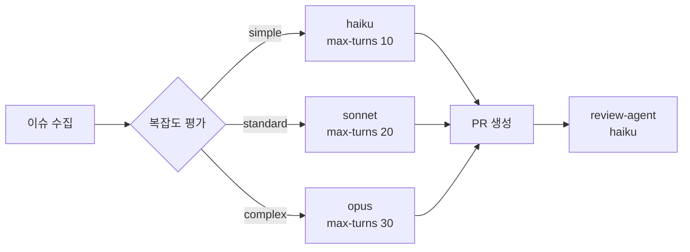

# collar 평가 프레임워크

**작성일:** 2026-05-20  
**목적:** collar 시스템 성능 측정 지표 + 모델 카테고리 평가 프로세스 정의

---

## 1. collar 프로그램 평가 지표

### 1.1 핵심 지표 (KPI)

| 지표 | 정의 | 목표 | 측정 방법 |
|------|------|------|----------|
| **이슈 자동해결율** | PR 생성 성공 / 전체 bug 이슈 | ≥ 60% | `.collar/github-processed.log` |
| **PR 병합율** | 병합된 PR / 생성된 PR | ≥ 70% | GitHub API |
| **review 통과율** | APPROVED / 전체 review | ≥ 80% | 로그 파싱 |
| **세션 복원율** | compact 로드 성공 / 세션 시작 | ≥ 90% | session-compact.md 존재 여부 |
| **Hashline 무결성** | 해시 일치 / 전체 파일 로드 | ≥ 99% | 10-session-ctx.sh 로그 |
| **모델 비용 효율** | 성공 건당 평균 토큰 | 감소 추세 | API 사용 로그 |

### 1.2 카테고리별 모델 성능 지표

```
collar-eval-model 실행 시 저장되는 지표 (JSON):
~/.collar/eval-results/<model>_<date>.json

{
  "model": "claude-sonnet-4-6",
  "scores": {
    "simple":   {"quality": 9, "speed_ms": 3200, "total": 7.8},
    "standard": {"quality": 8, "speed_ms": 5100, "total": 7.1},
    "complex":  {"quality": 7, "speed_ms": 8900, "total": 7.3}
  },
  "recommendation": "standard"
}
```

### 1.3 세션 관리 지표

| 지표 | 목표 | 측정 |
|------|------|------|
| session-compact.md 압축률 | memory.md 대비 30%↓ | collar-compact 출력 |
| 세션 재개 시간 | < 30초 | 수동 측정 |
| TODO 미완료 감지율 | > 95% | 50-todo-enforcer.sh 로그 |

---

## 2. 모델 카테고리 평가 프로세스

### 2.1 평가 도구

```bash
collar-eval-model <model-id>
```

`~/.collar/bin/collar-eval-model` 에 설치됨. 자세한 사용법은 `collar-eval-model --help`.

### 2.2 평가 항목 및 가중치

| 항목 | 설명 | simple | standard | complex |
|------|------|--------|----------|---------|
| **품질** (judge 채점) | 실제 해결 능력 | 60% | 70% | 85% |
| **속도** (응답 시간) | ms → 0-10점 역비례 | 40% | 30% | 15% |

> **철학 (OMO에서 배운 것):** 단순 작업은 속도가 품질만큼 중요하다. 복잡한 작업은 깊이가 속도보다 훨씬 중요하다.

### 2.3 카테고리 배치 기준

```
simple   → 빠르고 저렴. 품질 6/10 이상이면 충분.
standard → 신뢰도 균형. 품질 7/10 이상.
complex  → 깊이 우선. 품질 8/10 이상, 속도 2위.
```

### 2.4 권장 평가 주기

| 이벤트 | 행동 |
|--------|------|
| 새 모델 출시 | `collar-eval-model <new-model>` 즉시 실행 |
| collar-github 성능 저하 감지 | `--compare` 로 현재 vs 이전 모델 비교 |
| 월 1회 정기 검토 | `collar-eval-model --report` 로 트렌드 확인 |

### 2.5 실제 평가 예시

```bash
# 단일 평가
collar-eval-model claude-haiku-4-5-20251001

# 3개 모델 비교
collar-eval-model --compare \
  claude-haiku-4-5-20251001 \
  claude-sonnet-4-6 \
  claude-opus-4-7

# 결과 리포트
collar-eval-model --report
```

### 2.6 collar-github 연동

평가 결과는 collar-github의 모델 선택에 직접 반영된다.

현재 하드코딩된 매핑:
```python
COMPLEXITY_MODEL = {
    "simple":   "claude-haiku-4-5-20251001",  # eval 추천 기반
    "standard": "claude-sonnet-4-6",
    "complex":  "claude-opus-4-7",
}
```

미래 계획: `collar-github`가 `~/.collar/eval-results/` 를 읽어 동적으로 최적 모델 선택.

---

## 3. 구현 현황 (2026-05-20)

### 3.1 완료된 구현



| 기능 | 상태 | 파일 |
|------|------|------|
| 이슈 복잡도 라우팅 | ✅ 완료 | `bin/collar-github` |
| Hashline 무결성 | ✅ 완료 | `bin/collar-compact` |
| 10-session-ctx.sh | ✅ 완료 | `templates/collar-hooks/` |
| 50-todo-enforcer.sh | ✅ 완료 | `templates/collar-hooks/` |
| collar-eval-model | ✅ 완료 | `bin/collar-eval-model` |
| 모델 철학 규칙 | ✅ 완료 | `templates/global/CLAUDE.md.rules` |

### 3.2 미래 계획

| 기능 | 설명 | 우선순위 |
|------|------|---------|
| eval-results 자동 라우팅 | eval 결과로 collar-github 모델 동적 선택 | 🔴 |
| 40-session-recovery.sh | Stop 시 자동 compact + 재시작 | 🟡 |
| collar-metrics CLI | KPI 대시보드 출력 | 🟢 |
| 팀 모드 | 병렬 에이전트 (OMO Team Mode 개념) | 🟢 |

---

## 4. OMO에서 가져온 핵심 인사이트

1. **모델 ≠ 더 좋다/나쁘다**: 작업 성격과의 적합도가 중요
2. **Hashline**: AI 편집 전 파일 해시 검증으로 stale edit 방지
3. **5단계 훅 계층**: session → guard → transform → continuation → skill
4. **Todo Enforcer**: 미완료 TODO 자동 감지 → 재개 권고
5. **카테고리 라우팅**: 모델명이 아닌 "작업 성격" 기준으로 선택
