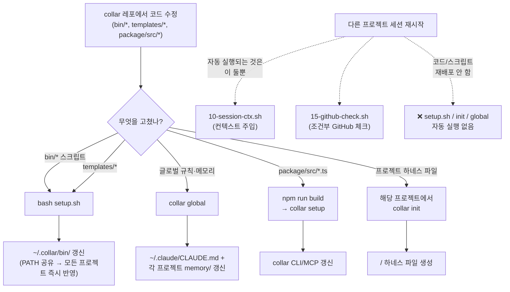

# collar 배포 전파 가이드 — "세션 재시작하면 자동 적용되나?"

날짜: 2026-06-13
검증: 4-에이전트 소스 전수 검증 (setup.sh, .collar/hooks/*, package/src/cli/*)

---

## 한 줄 답

**아니다.** collar 레포에서 코드/스크립트를 고쳐도 다른 프로젝트(investments 등)의 **세션 재시작만으로는 반영되지 않는다.** 새 bin 스크립트를 전파하려면 collar 레포에서 **`bash setup.sh`를 직접 1회 실행**해야 한다.

세션 재시작 시 자동으로 일어나는 일은 **컨텍스트 주입**(project-facts/session-compact/memory.md를 system-reminder로 읽기)과 **조건부 GitHub 체크**뿐이며, collar 코드/스크립트를 재배포하는 훅은 하나도 없다.

---

## 배포 채널 4종 (무엇이, 어떻게 전파되나)

| # | 채널 | 무엇이 들어있나 | 전파 명령 | 세션 재시작 자동? |
|---|------|----------------|-----------|:---:|
| 1 | **`~/.collar/bin/`** (공유 스크립트) | collar-init, collar-learn, collar-migrate-gstack, collar-metrics, collar-remember, collar-github … (셸 스크립트 전부) | `bash setup.sh` (glob 복사) | ❌ |
| 2 | **`~/.claude/CLAUDE.md` 글로벌 규칙 + 프로젝트별 메모리** | templates/global/CLAUDE.md.rules 섹션, templates/global/memory/*.md | `collar global` | ❌ |
| 3 | **`<project>/` 하네스 파일** | CLAUDE.md, AGENTS.md, .collar/config.json, .collar/memory.md, .collar/hooks/*.sh, .claude/settings.json | `collar init` (해당 프로젝트에서, 없을 때만 생성) | ❌ |
| 4 | **`package/src/*.ts` (CLI/MCP)** | setup.ts, state.ts 등 TypeScript 소스 | `npm run build` → `collar setup` 재실행 (또는 npm publish) | ❌ |

> **레포 내부 전용 (배포 대상 아님):** `CLAUDE.md`, `AGENTS.md`, `doc/*`, `.collar/tasks/*` 는 collar 프로젝트 자신의 메타 정보다. 다른 프로젝트로 복사되는 메커니즘이 없다.

---

## 세션 재시작 시 실제로 실행되는 것

`.claude/settings.json` 의 `SessionStart` → `.collar/collar-dispatcher.sh` → `.collar/hooks/*.sh` 이름순 실행. 이 중 SessionStart를 처리하는 훅은 **단 2개**:

| 훅 | 하는 일 | 코드 재배포? |
|----|---------|:---:|
| `10-session-ctx.sh` | project-facts.md / session-compact.md / memory.md 를 `cat` 해서 system-reminder 로 주입 | ❌ (컨텍스트만) |
| `15-github-check.sh` | github.json 이 `enabled=True` 일 때만 `collar-github run` + 백그라운드 `collar-global` 실행 | ❌ (글로벌 규칙 병합용, 스크립트 재배포 아님) |

나머지 훅(20-destructive-guard, 30-commit-guard, 60-session-monitor)은 PreToolUse/PostToolUse/UserPromptSubmit 만 처리하고, 40-session-recovery 는 SessionEnd 만 처리한다. **setup.sh / collar-init / collar global 을 자동 재실행하는 훅은 어디에도 없다.**

근거: `~/.collar/bin` 은 PATH에 등록돼 있어 모든 프로젝트가 같은 실체 파일을 가리킨다. 따라서 설치 스크립트를 재실행하지 않으면 새 스크립트는 **파일 자체가 존재하지 않는다.** 세션 재시작과는 완전히 무관하다.

---

## 전파 흐름



---

## 이번 세션 변경분을 investments 등에 반영하려면

최근 3개 커밋(6fb85c6, de8f8b4, d4ab41d)의 변경분을 소비 프로젝트에 전파하는 명령:

```bash
# 1) 새 bin 스크립트 + templates 를 ~/.collar/ 에 배포 (필수)
#    → collar-learn, collar-migrate-gstack, collar-metrics, collar-remember(갱신), collar-github(갱신)
#    PATH 공유라 실행 즉시 investments 포함 모든 프로젝트에서 사용 가능
cd /Users/ez2sarang/Documents/dev/ai/collar && bash setup.sh

# 2) TypeScript CLI 변경분(setup.ts cpSync, state.ts 스텁 제거) 컴파일 (CLI/MCP 사용 시)
cd /Users/ez2sarang/Documents/dev/ai/collar/package && npm run build

# 3) 소비 프로젝트가 templates/collar-hooks 훅 업데이트를 받으려면 (선택)
#    setup.sh 로 ~/.collar/templates 갱신 후, 해당 프로젝트에서:
cd <소비-프로젝트> && collar-init   # 멱등 — 기존 파일은 유지
```

> **CLAUDE.md / AGENTS.md / doc/* 변경은 전파 불필요** — collar 레포 자체 문서이며 다른 프로젝트로 배포되지 않는다.

---

## 핵심 비대칭 (주의)

`setup.sh` 의 **설치 경로는 glob**(`for f in bin/*; do cp ...`)이라 새 스크립트가 자동 포함되지만, **언인스톨 경로는 하드코딩 목록**이라 새 스크립트를 수동 등록하지 않으면 제거 시 잔존한다. 신규 bin 스크립트를 추가하면 `setup.sh --uninstall` 목록에도 반드시 추가할 것. (2026-06-13 collar-test 누락 잠복 버그를 이 비대칭이 유발 → de8f8b4 에서 4종 등록으로 해결.)
