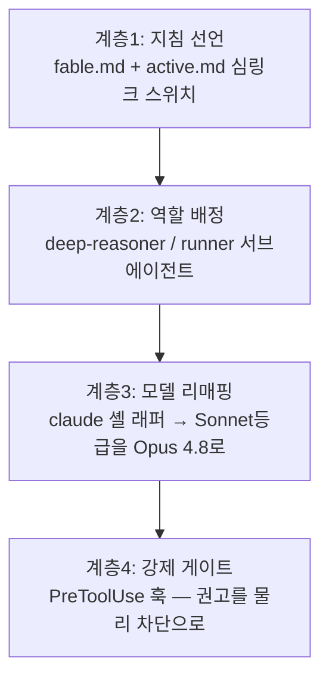

# Fable 5 오케스트레이션 — collar-fable 설계 문서

날짜: 2026-07-07
상태: 구현 완료 (VERIFIED — 게이트 합성 payload 14케이스 + 글로벌 설치 검증)
출처: 성공지식백과 "Fable 5 오케스트레이션 가이드" 영상(2026-07-05, YouTube I-JuFhY5W54)
슬라이드 76장 OCR 정밀검토 + Anthropic 공식 "The advisor strategy" (2026-04-09)

---

## 1. 문제

Fable 5는 가장 똑똑하면서 가장 비싼 모델이다 (입력 $10/M, 출력 $50/M — Opus 4.8의 2배).
Fable 5에게 보일러플레이트 작성·테스트 실행·파일 검색 같은 실행 작업을 시키면
비싼 토큰이 싼 일에 소모된다.

CLAUDE.md에 "지휘만 하고 위임하라"고 적는 것만으로는 부족하다 — 지침은 권고라서
모델이 판단에 따라 직접 코드를 고치는 일이 실제로 일어난다 (collar의 기존 원칙
"반복 위반 → 훅 강제화"와 동일한 결론).

## 2. 해법: 4계층 구조



| 계층 | 파일 | 동작 |
|------|------|------|
| 1 | `~/.claude/fable/fable.md` | 오케스트레이터 역할·라우팅·직접 처리 허용 범위(1~2개 파일 사소 수정) |
| 1 | `~/.claude/fable/active.md` | 심링크: `fable.md`(on) ↔ `empty.md`(off). `~/.claude/CLAUDE.md`는 `@import` 한 줄만 — 토글 시 CLAUDE.md 불변 |
| 2 | `agents/deep-reasoner.md` | Opus 4.8, effort max — 무거운 추론·설계·근본원인 분석 전담 |
| 2 | `agents/runner.md` | Haiku 4.5, effort low, tools: Bash/Read/Grep/Glob — 잡무 전담 |
| 3 | `env.sh` | `claude()` 래퍼 — 실행 시점마다 스위치를 읽어 on일 때만 `ANTHROPIC_DEFAULT_SONNET_MODEL=claude-opus-4-8` 주입. rc에 export 고정하면 off가 안 먹히므로 래퍼 방식 |
| 4 | `hooks/orchestration-gate.py` | PreToolUse — 아래 게이트 규칙 |

## 3. 강제 게이트 규칙

- 메인 에이전트는 한 턴(`prompt_id` 기준)에 코드 파일 **2개까지만** 직접 수정. 3개째 차단(exit 2) + 위임 지시.
- 같은 파일 재수정은 개수에 세지 않는다. md/json/yaml 등 설정·문서 파일은 제한하지 않는다.
- Bash 우회 경로(`sed -i`, `perl -i`, `>`/`>>` 리다이렉트, `tee`)로 코드 파일을 고치면 개수와 무관하게 차단.
- **서브에이전트는 전부 통과** — 훅 payload에 `agent_id`/`agent_type` 필드가 있으면 서브에이전트다 (공식 지원 구분법). 구분 없이 차단하면 위임 경로까지 죽는다.
- 스위치 off면 모든 검사 통과. 오류 시 통과(fail-open) — 게이트 버그로 세션이 마비되지 않게.
- `prompt_id`는 Claude Code **v2.1.196+** 필요 (턴 경계 감지). 없으면 fail-open.

## 4. 설치·운용

```bash
collar-fable install    # 멱등 — 기존 파일 변경 시 .bak-update-<ts> 백업 후 갱신
fable on|off|status     # 단축 명령 (~/.collar/bin/fable → collar-fable)
collar-fable uninstall  # 로딩 라인 포함 제거 (설정 본체는 보존)
```

로딩 코드 4종 (status가 전부 점검):
1. `~/.claude/CLAUDE.md` — `<!-- fable-loader -->` 마커 + `@~/.claude/fable/active.md`
2. `~/.zshrc`(및 `~/.bashrc`) — `env.sh` 소스 한 줄
3. `~/.claude/agents/{deep-reasoner,runner}.md` — 심링크
4. `~/.claude/settings.json` — PreToolUse 게이트 훅 (matcher: `Write|Edit|MultiEdit|NotebookEdit|Bash`)

**적용 시점 주의:** CLAUDE.md와 훅은 세션 시작 시 로드 → `fable on/off`는 다음 세션부터.
리매핑은 셸 래퍼를 거치는 실행(터미널 `claude`)에만 적용 — IDE 확장 등은 위임 시 model 명시로 보완.

## 5. 영상의 나머지 권고 (별도 구현 불필요)

| 권고 | 근거 | collar 반영 |
|------|------|------------|
| effort는 max/xhigh 대신 high | DeepSWE 벤치: max $22 ≈ xhigh $13 ≈ high $9 (성능차 ~1%) | 사용자 settings `effortLevel: high` 기적용 |
| Sonnet 5 워커 금지 | Opus 4.8보다 성능↓ 가격↑ (Sonnet5 max $26 > Opus max $13) | 계층3 리매핑이 sonnet 등급을 Opus 4.8로 강제 |
| advisor 전략 (SDK용) | 싼 실행자가 주도, 난제만 비싼 모델에 상담. Sonnet+advisor: SWE-bench Multilingual +2.7%/비용 -11.9%, Haiku+advisor: BrowseComp 19.7→41.2% | SDK 앱 작업 시 참고 (글로벌 CLAUDE.md advisor 항목·/claude-api 스킬) |

## 6. 기존 collar 구성과의 관계

- `opus-guard.sh`(권고형 키워드 안내)와 공존 — Claude Code는 등록된 PreToolUse 훅을 전부 실행하고 하나라도 차단하면 막는다.
- OMC executor 등 frontmatter `model: sonnet` 고정 에이전트가 리매핑의 주 수혜자.
- 글로벌 설치라 collar-init과 무관하게 investments 등 모든 프로젝트에 즉시 적용.
